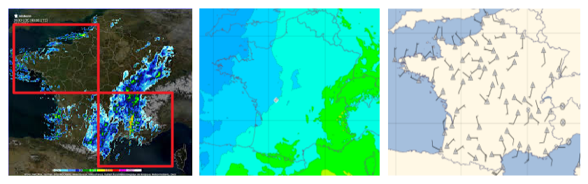

# Introduction

This repository is a toolbox to handle the MeteoNet dataset. 

*What is the MeteoNet Dataset ?*

<p align="center">
  
</p>

It is about a reference reinforced dataset in Meteorology dedicated to Data Science subjects (Machine Learning, Deep Learning). The format is adapted for Data Scientists.

Spatio-temporal framework : 
* 3 years : from 2016 to 2018
* 2 geographic area :  north-western and south-eastern quarters of France

Data types :
* Ground station observations
* Masks (land-sea and relief)
* Radar observations
* Satellite observations
* Weather models forecasts 


This toolbox includes data samples and notebooks to explore and cross-check all data types (grid or punctual data).

# Structure

This repository contains the following directories:
* *data_sample*: samples of each data type (ground_stations, radar...)
* *ground_stations*: notebooks to open ground_stations data
* *masks*: notebooks to open masks data (land-sea and relief masks)
* *radar*: notebooks to open radar data
* *satellite*: notebooks to open satellite data
* *superimpose_data*: notebooks with tools to superimpose all data types (grid and point data, different resolutions...)
* *utils*: python scripts useful for user configuration, functions useful to get coordinates, legends for plots...
* *weather_models*: notebooks to open weather models data

# Installation process

## I - Install the dependencies

2 installation ways are possible : either with Anaconda (the recommended way) or with pip.

### Recommended: install with Anaconda
* install Anaconda with Python 3

and then, type in a terminal **in this order** :

```sh
conda install -c conda-forge eccodes
conda install -c conda-forge cfgrib
conda install -c anaconda xarray
```

### Alternative way of installation: with pip
* install Python 3
* install pip

and then, type in a terminal (cf requirements.txt file in this repository):
```sh
pip install -r requirements.txt 
```

## II - Install the repository package

Once the dependencies installed, you can install the package located in our repository. This package contains libraries that will help you manipulate our data.

Go to the directory where you have cloned the repository, and enter:

```sh
pip install -e .
```

You will then be able to import the python files you need, for instance:

```python
import data_exploration.utils.coordinates_and_projection as cap
```


### Optional installation

To plot nice maps, you will need the basemap library. The recommended installation method is using anaconda through the conda-forge channel (Basemap is no longer uploaded to PyPI due to its size and non-python external dependencies).

```sh
conda install -c anaconda basemap
```

For some distributions, this installation of basemap is not sufficient. 
You might need to install *basemap-data-hires*:

```sh
conda install basemap-data-hires
```

### Troubleshooting: in case of librairies import issues

You could have issues when you use the librairies xarray or basemap. 
* issue with the xarray library -> PROBLEM OF TYPE "ECCODES ERROR   :  Unable to find boot.def, the environment variable ECCODES_DEFINITION_PATH is defined but incorrect"

The solution is to indicate the path to the file 'boot.def'. 

* problem with the basemap library -> PROBLEM OF TYPE "KeyError : 'PROJ_LIB'"

The solution is to indicate the path to the file 'epsg'. 

Examples of paths on Windows are indicated in the script utils/user_configuration.py.


