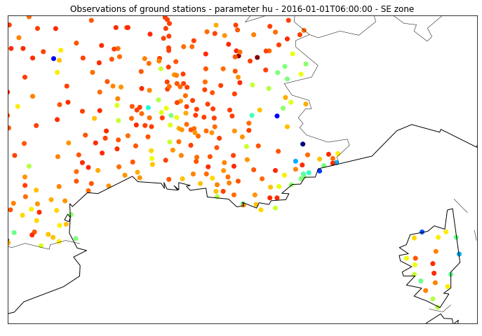

# Ground Observation

Hundreds of observation stations are built throughout the French territory, each one fitted with several sensors measuring parameters such as temperature, pressure, wind... Each parameter is measured every 6 minutes and each file contains 1 month of data for each geographical area ('NW' for North-West of France and 'SE' for South-East of France). 

### Metadata

| Name | Description | Unit |
| -----| ----------- | ---- |
| number_sta | ground station ID | - |
| lat | latitude | decimal degrees (10-1 °)|
| lon | longitude | decimal degrees (10-1 °)|
| height_sta | station height | meters (m) |
| date |  a datetime object | format 'YYYY-MM-DD HH:mm:ss' |

### Meteorological parameters

| Name | Description | Unit |
| -----| ----------- | ---- |
| dd | Wind direction | degrees (°) |
| ff | Wind speed |  m.s-1|
| precip | Precipitation during the reporting period | kg.m2|
| hu | Humidity | percentage (%) |
| td |  [Dew point](Documentation/Glossary/#dewpoint) | Kelvin (K) |
| t |  Temperature | Kelvin (K) |
| psl |  Pressure reduced to sea level | Pascal (Pa) |