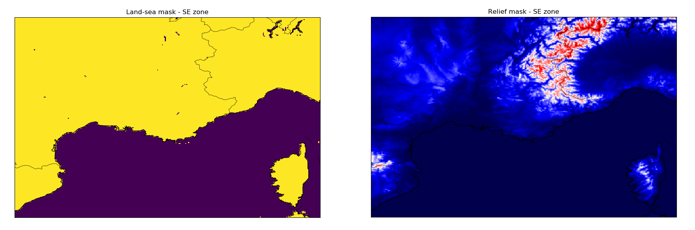

# Land-Sea and Relief Masks



For each geographical zone ('NW' for North-West of France and 'SE' for South-East of France), two different masks are stored in a GRIB file:
* the **land-sea mask**, called 'lsm' in the file. The values are binary : 0 for sea and 1 for land.
* the **relief mask**, called 'p3008' in the file. The values are in meters.

The spatial resolution of the masks is 0.025°. 

Note : When you open a GRIB file with the library xarray, a new associated ```.idx``` file is created. 
