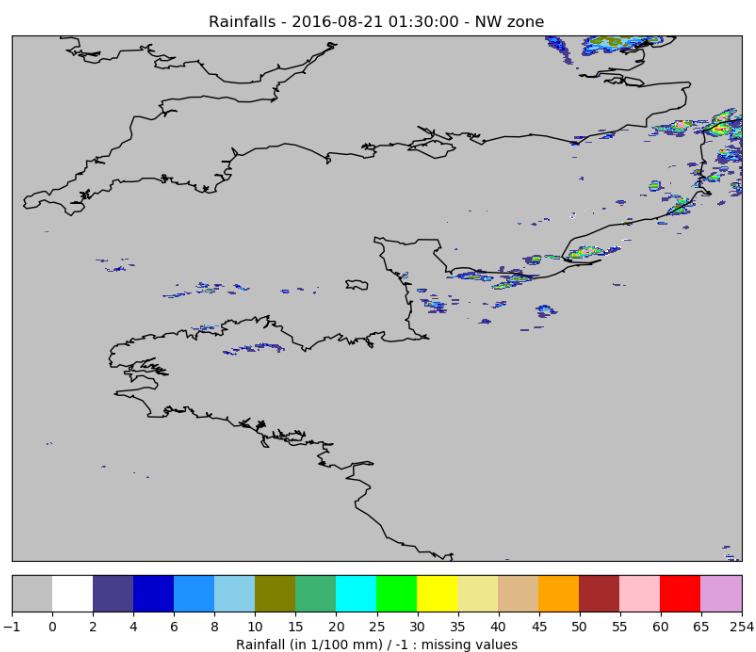
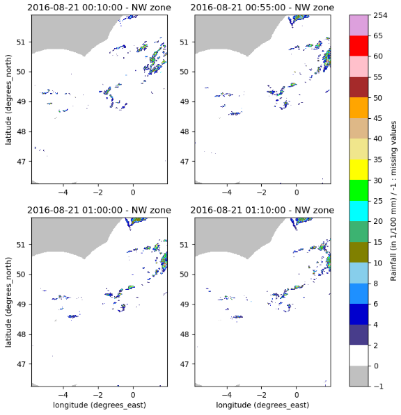
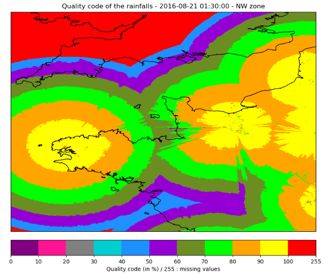
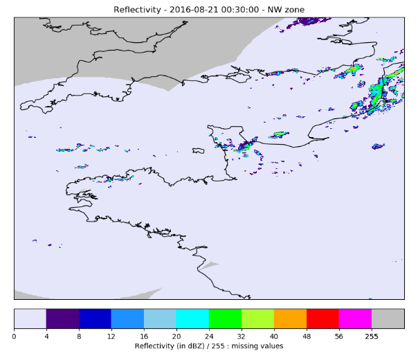

# Rain Radar

## Radar Data

For each radar data type, you will find one archive per year and per zone, each one sliced in periods of 10 or 11 days (each month is separated in 3 files). 

Each `.npz` file contains 3 arrays :

* `data` : an array containing maps of radar data values.

* `dates` : an array containing a datetime object and indicating the date of each `data` map.

* `miss_dates` : an array containing a datetime object for each missing radar map over the period.

The time step between two radar scans is 5 min. The radar starts scanning at 00h every day and ends at 23h55. So each file of 11 days should contain a maximum of 3168 rainfall maps (minus the missing dates).

The radar's spatial resolution is 0.01° and the projection system used is EPSG:4326.

You will also find a `radar_coords_ZONE.npz` file containing 2 arrays `lats` and `lons`, indicating the coordinates (latitude and longitude) of the center of each radar pixel.

## Cumulated Rainfall 

### Description

The rainfall data is organized as specified [here](#rain-radar-data).

The `data` array contains a rainfall map for each time step. For each pixel, the value represents the cumulated rainfall in hundreth of millimeters (\(10^{-2} mm\)). If the value is missing then the value is -1.

### Files organization

The files are stored with 4 compression levels : 

* two per year (.tar.gz and .tar)
* two per month (.tar.gz and .tar). 
  
For each month, the data are stored per period of 10 or 11 days (each month is separated in 3 files) : 

* part 1 : from day 1 to day 9
* part 2 : from day 10 to day 20
* part 3 : from day 21 to day 30 or 31 according to the month

Example

Here is the path for the NW zone, year 2016, January, first part of month (from day 1 to day 9) : */data/NW/radar/rainfall/NW_rainfall_2016.tar.gz/NW_rainfall_2016.tar/NW_rainfall_2016/rainfall-NW-2016-01.tar.gz/rainfall-NW-2016-01.tar/rainfall-NW-2016-01/rainfall_NW_2016_01.1.npz*

## Rain Radar Quality Code

### Description

For each pixel of the rainfall product is associated a quality code with values ranging between 0 (very bad) and 100 (perfect), the values are in percents. If the value is missing, then the value is 255.

The rain radar quality code data is organized as specified [here](#rain-radar-data). The original data was to heavy to be manipulated so the quality code data are divided into 2 files :

* `rainfall_mean_quality_DATE.npz` contains the quality code's average over a day and for each pixel.
  
* `rainfall_diff_quality_DATE.npz` contains the difference between the original value and the average over the day for each pixel.

!!! info
    **Remark about the average quality code computation** : if there is no value for a whole day on 1 pixel, it will be indicated as a missing value in the `mean` file, else the mean computation is done over the non missing values for 1 day and 1 pixel.

### Files organization

The files are stored in the same way as the [cumulated Rainfall](#rain-radar_data_org) (4 compression levels). At the month level, the files are split into two categories : `mean` and `diff` (cf part Description above). 
For example, for the NW zone, year 2016, January, there are two files : 

* rainfall-mean-quality-code-NW-2016-01.tar.gz
* rainfall-diff-quality-code-NW-2016-01.tar.gz
  
Example

Here are the paths for the NW zone, year 2016, January, first part of month (from day 1 to day 9) : 

* `mean` data : */data/NW/radar/rainfall_quality_code/NW_rainfall_quality_code_2016.tar.gz/NW_rainfall_quality_code_2016.tar/NW_rainfall_quality_code_2016/rainfall-`mean`-quality-code-NW-2016-01.tar.gz/rainfall-`mean`-quality-code-NW-2016-01.tar/rainfall-`mean`-quality-code-NW-2016-01/rainfall_`mean`_quality-code_NW_2016_01.1.npz*
* `diff` data : */data/NW/radar/rainfall_quality_code/NW_rainfall_quality_code_2016.tar.gz/NW_rainfall_quality_code_2016.tar/NW_rainfall_quality_code_2016/rainfall-`diff`-quality-code-NW-2016-01.tar.gz/rainfall-`diff`-quality-code-NW-2016-01.tar/rainfall-`diff`-quality-code-NW-2016-01/rainfall_`diff`_quality-code_NW_2016_01.1.npz*

## Reflectivity

The reflectivity is a measure of the efficiency of a radar target in intercepting and returning radio energy. Each radar emits a signal which is partly reflected by the precipitation and returned to the radar's receiver. The returned signal's power is then compared to a reference power density at a distance of 1 meter from the radar's antenna before computing the reflectivity.

The reflectivity factor **Z** is measured in decibels (dBZ), which can be approximated to a rainfall rate **R**, expressed in millimeter per hour (mm/h), using the Marshall-Palmer relation:
$$ Z = 200.R^{1.6} \iff  R = (\frac{Z}{200})^\frac{1}{1.6}$$

!!! info
    The `200` and `1.6` coefficients depend on the type of rain and are specific to mainland France.

In 2018, METEO FRANCE introduced a new reflectivity product, with additional data (rainfall probability, height measures,...), which definitively replaced the old product in November 2018. Consequently, during the first part of 2018, the two products overlap and both data are available in the dataset.

### Old Product

#### Description

!!! warning
    The old product data range from 01/01/2016 to 30/10/18 included. 

The rain radar data are organized as specified [here](#rain-radar-data).

Each pixel of the `data` array contains a reflectivity value expressed in dBZ, computed using the lower bound of reflecivity levels as follows :

| Level | Reflectivity Range | Data value |
| ----- | ------------------ | ---------- |
| 0     | \(Z < 8\) dBZ      | 0          | 
| 1     | \(8 < Z < 16\) dBZ | 8          |
| 2     | \(16 < Z < 20\) dBZ| 16         |
| N     | \(17 + N < Z < 18 + N\) dBZ | \(17 + N\) |
| 53    | \(70 \leq Z\) dBZ | 70 |
| 255   | No value or missing data | 255 |

#### Files organization

The files are stored in the same way as the [cumulated Rainfall](#rain-radar_data_org) (4 compression levels). 

Example

Here is the path for the NW zone, year 2016, January, first part of month (from day 1 to day 9) : */data/NW/radar/reflectivity_old_product/NW_reflectivity_old_product_2016.tar.gz/NW_reflectivity_old_product_2016.tar/NW_reflectivity_old_product_2016/reflectivity-old-NW-2016-01.tar.gz/reflectivity-old-NW-2016-01.tar/reflectivity-old-NW-2016-01/reflectivity_old_NW_2016_01.1.npz*

### New Product

#### Description

!!! warning
    The new product data range from 01/02/2018 to 31/12/18 included. 
 
The new reflectivity product introduced the following changes :

* a new data processing algorithm 
  
* the reflectivity minimum detection threshold reduced from 8 to -9 dBZ

* the reflectivity values with a step of 0.5 dBZ

* 2 additionnal products : rain probability and selected measure height

The rain radar data are organized as specified [here](#rain-radar-data), with 2 additionnals arrays `prob` and `height`, and contains the following data :

* `data` : reflectivity values (in 1/10 dBZ)

* `prob` : rain probability (in %)
  
* `height` : selected measure height (in m)

The '*non detection data*' value is -100 and the '*missing data*' value is -200.

#### Files organization

The files are stored in the same way as the [cumulated Rainfall](#rain-radar_data_org) (4 compression levels). 

Example

Here is the path for the NW zone, year 2018, March, first part of month (from day 1 to day 9) : */data/NW/radar/reflectivity_new_product/NW_reflectivity_new_product_2018.tar.gz/NW_reflectivity_new_product_2018.tar/NW_reflectivity_new_product_2018/reflectivity-new-NW-2018-03.tar.gz/reflectivity-new-NW-2018-03.tar/reflectivity-new-NW-2018-03/reflectivity_new_NW_2018_03.1.npz*
