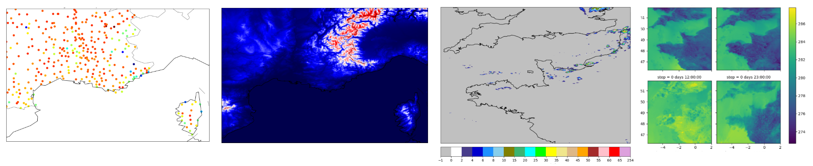

# Accueil

Bienvenue sur la documentation de [MeteoNet](https://meteonet.umr-cnrm.fr/index.html) ! 

## Qu'est ce que MeteoNet ?

MeteoNet est un jeu de données météorologiques ouvert, créé par Météo-France, le service météorologique Français. Notre but est de fournir un jeu de données néttoyé et prêt à utilisé pour les Data Scientists qui s'intéressent aux données météo.

Les données couvrent 3 ans, de 2016 à 2018, sur deux zones géographiques : le nord-ouest et le sud-est de la France.

Le jeu de données est constitué de **données d'observation au sol**, de **masques relief et terre-mer**, d'**observations des radars de pluie** et de **prévisions de modèles météo**. Nous prévoyons aussi de vous donner des images satellite prochainement !

Si vous souhaitez commencer à explorer notre dataset, rendez vous sur [Par où commencer ?](commencer.md) !

## Pourquoi MeteoNet?

Un jeu de données complet et nettoyé est une chose pour commune pour les Data Scientists, et c'est ce que nous voulons fournir à la communauté.

Nous cherchons toujours à améliorer notre connaissance de la météorologie et des prévisions météo et nous espérons donc qu'en ouvrant ce jeu de données à la communauté scientifique, des personnes partout dans le monde pourrons trouver de nouvelles façons d'améliorer la météorologie grace à la science des données.

## A propos de Météo France

Météo-France est le service Français de météorologie. Sa mission principale est d'assurer la sécurité des personnes et des biens sur le territoire Français. Une autre de ses missions est de garder la mémoire du climat et d'aider les politiques publiques à anticiper le changement climatique. Météo-France a une forte présence internationale et représente la France à l'Organisation Météorologique Mondiale. L'institut est aussi membre d'EUMETSAT, responsable de la gestion des satellites météorologiques Meteosat, et un membre important de l'ECMWF. De plus, Météo-France accueille l'un des deux centres de modèles de prévision numérique de l'IFS, utilisé partout dans le monde.

